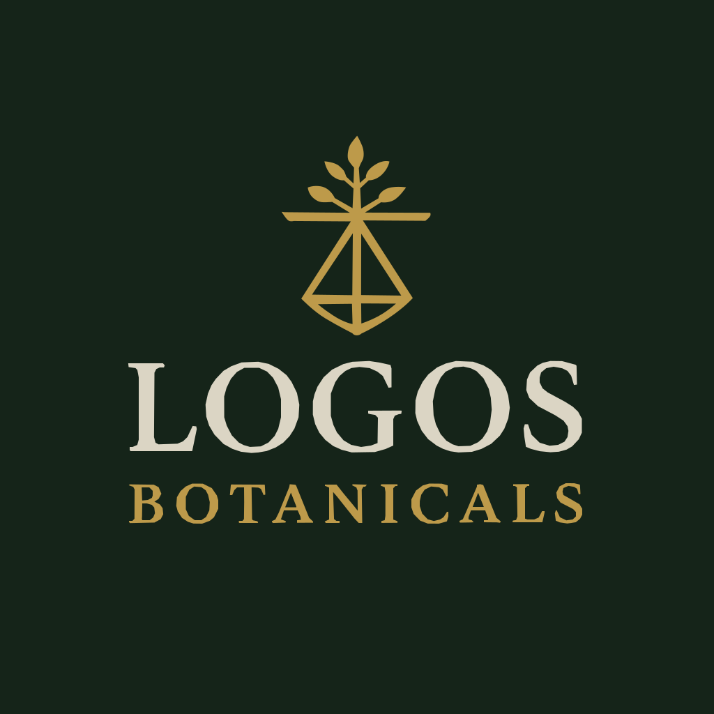

# Brand Style Guide

**Brand Name:** LOGOS BOTANICALS  

**Tagline:** "Global Cannabinoid Sourcing Backed by Trust, Scale, and Science"

**Slogan:** "Supplying high-quality cannabinoids to top global brands"  

**Mission:** "To provide trusted, transparent, and scalable cannabinoid sourcing to brands across the globe. Combining science, service, and integrity to build the future of plant medicine."

## IMAGES

### Primary Logo:  

### Icon Logo:  

## COLORS  

|Color Name |	Hex |	Usage|
|---|---|---|
|Primary Green	| #001d0c	| Buttons, titles|
|Secondary Gold |	#a78738 |	Links, accents|
|Background	| #f9fafb | Main background|
|UI Component|#f3f4f6| Panels, cards |
## Typography

Google Font for web copy:  
text: [Merriweather]()  
UI: [Roboto Condensed]() 

Google Fonts like brand logo:   
[Cormorant Garamond](https://fonts.google.com/specimen/Cormorant+Garamond)  
[Cinzel](https://fonts.google.com/specimen/Cinzel)

Icon Pack: [Lucide](https://lucide.dev/), custom SVG

Primary Buttons: Pill-style, serif text  
Secondary: Bold colored text style
